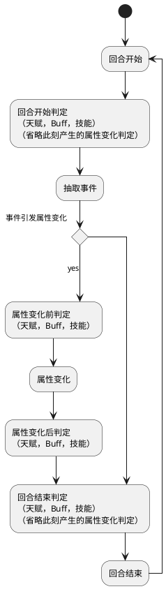

# 人生重来器

> 早期开发中，随时可能弃坑

Pure Scala "life restart game" implement

## 词汇表

| 名称 | 关键词       | 属于  | 含义                                  |
| ------ |-----------| ------- |-------------------------------------|
| 角色 | Player    |       | 玩家的虚拟角色（避开 java.lang.Character）     |
| 回合 | Round     |       | 在该游戏中，每一岁为一个回合，回合开始和结束时分别进行结算       |
| 属性 | Attr      |       | 角色属性，基本数据，一般是数值类型(整数，向下取整)          |
| 标签 | Tag       | Attr  | 属性的一种，用于标识角色，一般是文本类型                |
| 生命 | Health    | Attr  | 属性的一种，当低于 0 时，在回合结束阶段角色立刻死亡         |
| 技能 | Skill     |       | 角色的能力，在遇到某些事件或在满足条件时触发              |
| 天赋 | Talent    | Skill | 能力的一种，可以在开场时抽取，并且没有附加条件的天赋将在开场时自动生效 |
| 状态 | Buff      |       | 角色的状态，每回合进行结算                       |
| 事件 | Event     |       | 可能会影响角色的属性，技能及状态，每回合抽取一个            |
| 条件 | Condition |       | 触发机制的条件，回合相关操作和属性相关操作时将进行判定         |
| 轨迹 | Path      |       | 角色的总体人生轨迹，决定了大致的人生走向                |
| 结局 | Ending    |       | 在角色死亡（或其他条件时），进行结算并给出结局             |

## 回合流程

